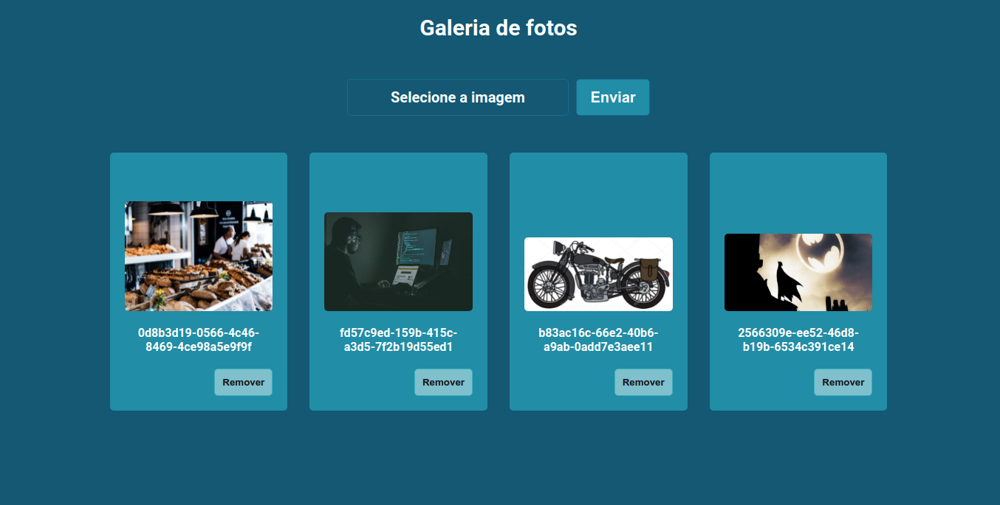

<h1 align="center">
  Galeria de Fotos
</h1>

<p>Um simples app de galeria de fotos, usando ReactJS e Firebase Storage</p>


<video src='./screens/home.png'/>

## Technologies used
  - [React](https://pt-br.reactjs.org/)
  - [Typescript](https://www.typescriptlang.org)
  - [Styled Components](https://www.styled-components.com)
  - [Firebase](https://firebase.google.com/)

## Config used
  - [Eslint](https://eslint.org)
  - [Husky](https://typicode.github.io/husky/#/)
  - [Lint Staged](https://github.com/okonet/lint-staged)
  - [Editor Config](https://editorconfig.org/)

## Getting Started

First, install all dependencies:

```bash
yarn install
```

Second, run the development server:

```bash
yarn start
```

Open [http://localhost:3000](http://localhost:3000) with your browser to see the result.

